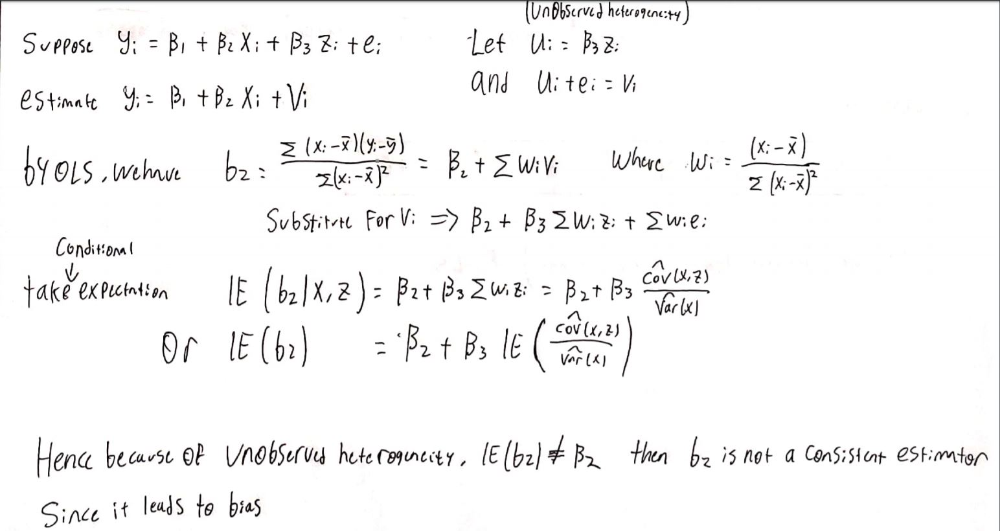
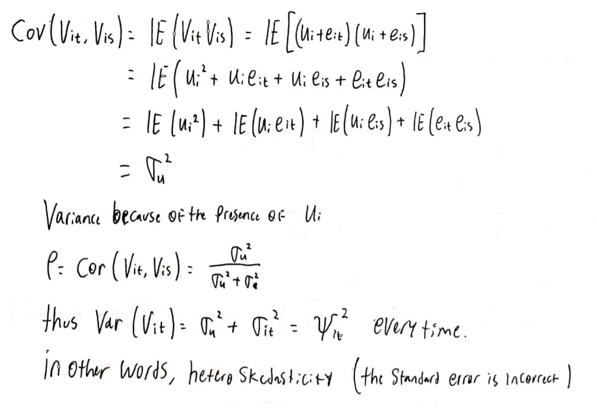
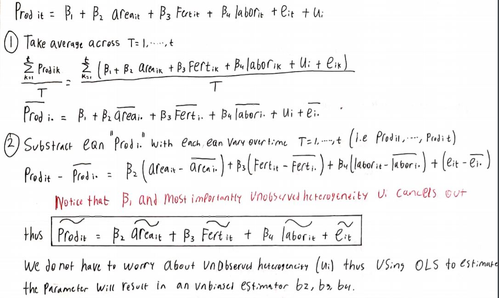
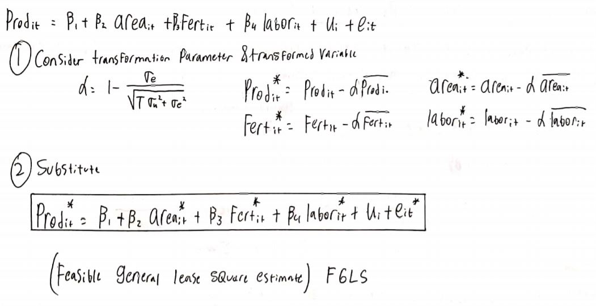

```{r setup, include=FALSE}
knitr::opts_chunk$set(echo = TRUE)
```

### (a) Propose an Econometric question that can be analyzed with at least one of the methods studied in the course. 
Research study on how different predictors such as Fertilizer, Area, and number of labor affect production of rice in a firm. Using the properties of Panel data, we can implement different estimates method to determine which is the best estimator for the panel data regression.

### (b) Describe why answering the question in (a) is useful.  (Who would be interested in the answer and why?)
By providing a statistically significant evidence on some of the variables for the rice production, an agribusiness company can effectively decide on an optimal act to manage their resources. This information is especially useful for Production Analyst that works for this type of company. It also useful for some researcher who would like to develop a new invention approach on rice production. 

### (c) Describe the model you would estimate to provide an answer to (a).
#### prod~it~ = b~1~ + b~2~ area~it~ + b~3~ fert~it~ + b~4~ labor~it~ + u~i~+ e~it~

Where:

~i~ indicates each different observations

~t~ indicates each different time periods

firm:	 Firm number (1 to 44)
  
year:	 Year = 1993 to 1994
	
prod:	 Rice production (tonnes)
	
area:	 Area planted to rice (hectares)
	
labor: Hired + family labor (person days)
	
fert:	 Fertilizer applied (kilograms)

### (d)  Describe the data you would use. (You may choose any of the data sets used in the textbook or any other data set.)

I use the data sets from textbook called "rice5.Rdata", the data includes 6 columns, one of them be the time variable. The other five includes the production of the rice in tons, area of planted rice in hectares, number of labor person per days, and weights of fertilizer applied. The one variable that is logical to be considered as an output variable is prod which is the rice production in tons.

### (e) Explain the issues you would need to worry about to be confident on the results you would report (e.g., misspecification, omitted variables, measurement error, heteroskedasticity, etc.)  For each issue, explain using equations why you would need to worry about it. 

1. Unobserved Heterogeneity: If unobserved heterogeneity exists, we do have to consider that factor into account since if not it could lead into a misleading estimate. 


2. Time variant variable: We have to consider if the variables that we analyze is consistent over time or not. If it is then we can apply the appropriate method into it. But if not, we will have to randomize the parameter and also the whole equation in order to minimize the impact of the time variant variable.



### (g) Explain how you would deal with the issues you listed in (e). 
1. Unobserved Heterogeneity: Using Fixed Effect model to cancel out the unobserved heterogenerity, leading to an unbiased estimates for the model



2. Time variant variable: Using the Random Effect Model which take into account the cluster standard error and transformed the each variable to account for the inconsistent error (Using Feasible GLS model)


### h) Perform the analysis in (c) using the data in (d) and report the results. 
Import the relevant library
```{r}
library(plm)
```

Import the data
```{r}
load('rice5.rdata') #Downloaded from CCLE "Data and Code for R"
rice <- rice5 #load into variable for convenience purpose
head(rice)
```

Understanding each variables definition
```{r}
rice_def <- read.csv("rice_def.csv", header = TRUE)
rice_def
```

Set the data into a panel data
```{r}
rice <- pdata.frame(x = rice, index = c("firm", "year"))
```

Set up the independent and dependent variable as x and y respectively
```{r}
attach(rice)
y <- cbind(prod) #independent variable "prod" (Rice production in tonnes) 
x <- cbind(area, fert, labor) #dependent variables 
```

Look at the descriptive statistics and normality of each variables
```{r}
summary(y)
```
```{r}
hist(y, main = "Rice Production Distribution", xlab = "Rice Production (tonnes)")
```

```{r}
summary(x)
```
```{r}
hist(x[,1], main = "Area Planted Distribution", xlab = "Area (Hectares)")
```

```{r}
hist(x[,2], main = "Fertilizer applied Distribution", xlab = "Fertilizer applied (Kilogram)")
```

```{r}
hist(x[,3], main = "Hired + family labor Distribution", xlab = "Hired + family labor (Person days)")
```


Run the panel data regression using different estimator:

_Pooled OLS Estimator_
```{r}
plm1 <- plm(prod ~ area + fert + labor, data = rice, model = "pooling")
summary(plm1)
```

_Within Estimator_
```{r}
plm3 <- plm(prod ~ area + fert + labor, data = rice, model = "within")
summary(plm3)
```

_First Difference Estimator_
```{r}
plm4 <- plm(prod ~ area + fert + labor, data = rice, model =  "fd")
summary(plm4)
```

_Random Effects Estimator_
```{r}
plm5 <- plm(prod ~ area + fert + labor, data = rice, model = "random")
summary(plm5)
```

LM test for random effect vs OLS (random vs pooled)
```{r}
plmtest(plm1)
```
Fail to reject the null thus random effect is not appropriate.

F-test for fixed effect vs OLS (within vs pooled)
```{r}
pFtest(plm3, plm1)
```
Reject the null thus fixed model is appropriate.

Hausman test for fixed effect vs random effect model
```{r}
phtest(plm3, plm5)
```
Since we reject the null, we will choose fixed model.


